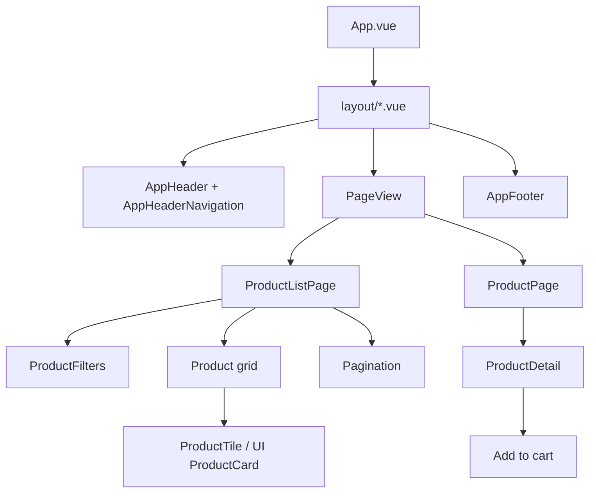

# InfinityElectronics Frontend Case (Vue 3 + Vite)

This repository is a small e-commerce SPA built with Vue 3, Vite, Vue Router and Pinia.
It demonstrates a scalable component/page architecture, a small foundational UI component library, and production-oriented concerns such as code-splitting, loading/error states, and accessibility basics.

## Quick start

- Install: `npm install`
- Dev server: `npm run dev`
- Typecheck + build: `npm run build`

Optional (component library / stories): `npm run storybook`

---

## 1) Architecture design

### Component structure and organization

The code is organized by intent:

- `src/pages/`: Route-level “screens” (PLP, PDP, Basket, Home).
- `src/views/PageView.vue`: Dynamic route->page resolver (centralizes lazy loading + fallback UI).
- `src/layout/`: Layout shells (default, basket, error). Chosen by route meta.
- `src/components/`: App-specific components (navigation, cart flyout, product detail, filters, etc.).
- `src/ui/`: Foundational UI components intended to be shareable across apps (Hero, ProductCard, FeaturedProducts).
- `src/composables/`: Feature hooks (PLP/PDP data fetching, URL sync, derived state).
- `src/stores/`: Pinia stores (cart).
- `src/api/`: API client boundary (fakestore API mapping).
- `src/models/`: Domain types.

### State management approach

- **Pinia store** for cross-cutting, long-lived state (cart). This enables real-time updates across pages (header badge, flyout, basket).
- **Composables** for feature-local state and derived logic (filters, pagination, URL sync, data fetching).
- **Props + events** for leaf UI components (especially the shareable `src/ui/*` components).

This avoids a “global store for everything” and keeps page logic close to the pages while still having a single source of truth for the cart.

### Routing strategy

Routing is handled by Vue Router.

- Route records point to a single `PageView` component.
- `route.meta.pageKey` selects the actual page component.
- `route.meta.layoutKey` selects the layout shell.

This provides:

- One place to enforce route-level Suspense fallbacks.
- Built-in route-level code splitting via `defineAsyncComponent`.
- Easy addition of new seasonal campaigns/layouts by adding a layout and swapping `layoutKey`.

### Performance optimization techniques

Already implemented:

- **Route-level code splitting**: pages and layouts are lazy-loaded.
- **Suspense fallback**: a lightweight loading placeholder is rendered while chunks load.

Recommended next steps (high-level):

- Preload critical route chunks on idle or on hover of nav links.
- Use responsive images (width descriptors / `srcset`) and a real image CDN.
- Cache/collapse repeated API requests with an in-memory cache or SWR-like layer.
- Consider SSR/SSG for best Core Web Vitals if SEO is important.

---

## 2) Diagrams

### High-level architecture

```mermaid
flowchart TD
	U[User] --> R[Vue Router]
	R --> L[Layout resolver (route.meta.layoutKey)]
	L --> PV[PageView (route.meta.pageKey)]
	PV --> P[Lazy-loaded Page]
	P --> C[App components]
	C --> UI[UI library components (src/ui)]

	P --> CMP[Composables (usePLP/usePDP)]
	CMP --> API[API client (src/api)]
	API --> NET[(Network)]

	C --> S[Pinia store (cart)]
	P --> S
```

### Component hierarchy (typical)



---

## 3) Component library (shareable)

The foundational UI components live in `src/ui/`.

Design goals:

- Stateless by default (emit events instead of depending on the store).
- Documented via stories.
- Packagable later as a standalone npm package (e.g. in a monorepo workspace).

Suggested future packaging approach:

- Move `src/ui` into `/packages/ui`.
- Build as a library with Vite library-mode.
- Publish as an internal npm package and consume from multiple apps.

---

## 4) Themes and seasonal layouts

Layouts are already supported via route `meta.layoutKey`.
Themes are intended to be applied via CSS variables (e.g. `html[data-theme="default"]`, `html[data-theme="black-friday"]`).

Recommended approach:

- Define a small set of design tokens (surface, text, brand, border).
- Let campaigns override tokens rather than hard-coding colors in components.

---

## 5) UX + accessibility

Implemented patterns:

- Loading states via Suspense fallback.
- Error/empty states on pages.
- Semantic navigation (`aria-label`) and basic button/link semantics.

Recommended next steps:

- Keyboard focus states for all interactive elements.
- Proper `aria-live` usage for cart updates.
- Add automated a11y checks in Storybook (`@storybook/addon-a11y`).
